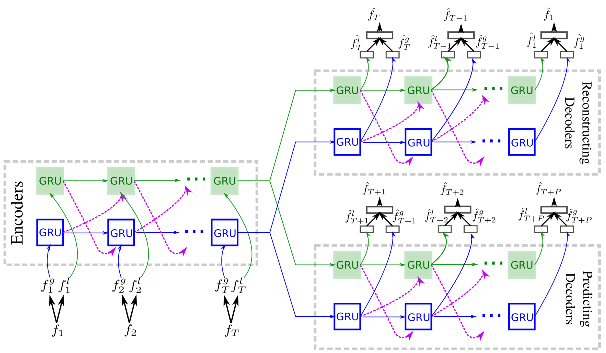
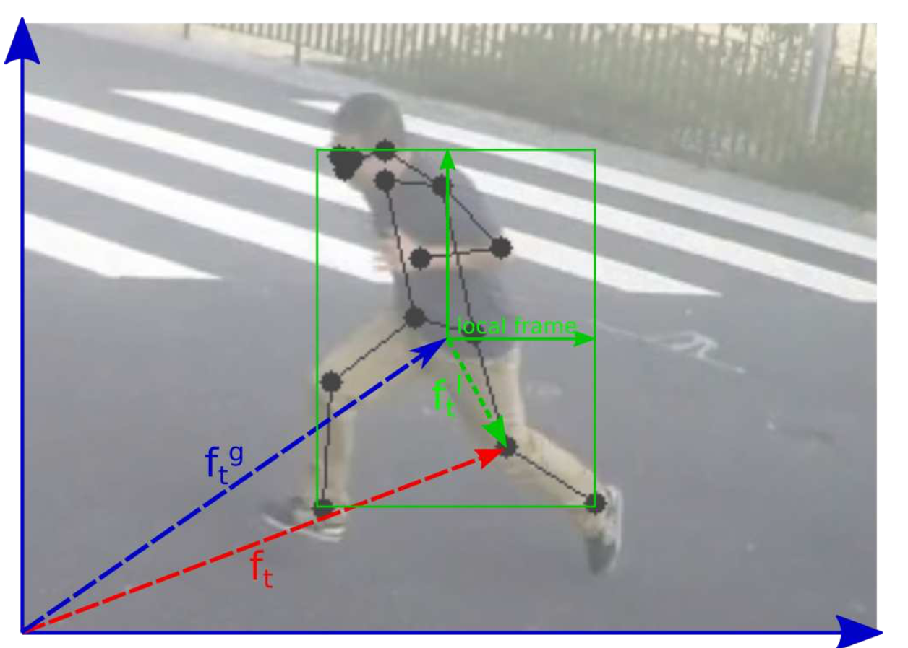

<div align="center">

# The Eye: an AI pipeline for parking surveillance and monitoring

</div>

This project implements a Computer Vision pipeline for surveillance and monitoring of parking areas. Using a fine-tuned version of YOLOv11, metrics are computed from raw footage, which helps data-driven decision making for companies and people owning the parking, while a trained MPED-RNN (privacy focused) is able to detect anomalous behavior to guarantee safety and protection. 

>[!Note]
> For this project we have used [Claude Code](https://claude.com/product/claude-code) to help us develop the code in a short amount of time. It has been used primarily to implement the models, algorithms and details necessary for the correct functionality of the pipeline, while the ideas, research and this documentation is human-written. 

## 1. Setup

Before running the code, make sure to setup the submodule and create a virtual environment with required dependencies:

```bash
git submodule update --init
uv venv .venv --python 3.11
source .venv/bin/activate
uv pip install -r requirements.txt
uv pip install -e ./dlp-dataset
```

>[!Important]
> You have to download the data from the sources provided and put them in a `data/` folder with the following structure:
> ```
> .
> ├── processed
> └── raw
>     ├── CHAD
>     └── DLP
>         ├── json   (DLP JSON ground truth files)
>         └── raw    (DLP video files: .MOV, _data.xml)
> ```

Finally, make sure you download both the fine-tuned YOLOv11 on VisDrone (`bestVisDrone.pt`) and the trained MPED-RNN (`best_model.pt`) from [this](https://drive.google.com/drive/folders/1LtQhqy_BYjI8ZMq4c_lgLZOuBSteRDDN?usp=sharing) Drive folder and put them in the relative correct folder:

```bash
# from root
mv ~/<path_to_YOLOv11_fine_tuned> models/yolo11n-visdrone/
mv ~/<path_to_MPED-RNN> models/anomaly/cam_1_2_3_4/
```

## 2. How to run the code

The code is modular and follows the structure displayed below. To start the web application with Streamlit, you have to first run the whole pipeline on test videos. Make sure you have downloaded at least a video from the [DLP](https://sites.google.com/berkeley.edu/dlp-dataset) dataset (they let you download a sample like we did) and at least one from each camera from the [CHAD](https://github.com/TeCSAR-UNCC/CHAD) dataset, and put them in the correct directory as outlined above. To run the main pipeline:

```bash
# Full pipeline (detection + metrics)
uv run  -m src.pipeline.run --video data/raw/DLP/raw/DJI_0012.MOV

# Skip detection, recompute metrics only
uv run -m src.pipeline.run --video data/raw/DLP/raw/DJI_0012.MOV --skip-detection

# Process only first 4500 frames (~40% of video)
uv run -m src.pipeline.run --video data/raw/DLP/raw/DJI_0012.MOV --max-frames 4500
```

While for the anomaly detection pipeline run:
```bash
# Train on CHAD (normal sequences only)
python -m src.anomaly.train --data-root data/raw/CHAD/CHAD_Meta

# Evaluate trained model
python -m src.anomaly.evaluate --model-dir models/anomaly/cam_1_2_3_4
```

Then you can start the interactive dashboard:

```bash
# from root directory
PYTHONPATH=. streamlit run dashboard/app.py
```

>[!Note]
> The dashboard shows metrics, model performance and live demo, so it is necessary to run the pipeline if you want to be able to see all the tabs.

## 2. Architecture & Code Structure

```
SpringHackathon-2026-VisionX/
├── src/
│   ├── detection/
│   │   ├── base.py              # Abstract detector + data classes
│   │   └── yolo_detector.py     # YOLOv11 + ByteTrack implementation
│   ├── pipeline/
│   │   ├── homography.py        # Pixel-to-ground coordinate mapping
│   │   ├── metrics.py           # All metric computations (batch)
│   │   ├── realtime.py          # Incremental metrics for live demo
│   │   └── run.py               # CLI pipeline orchestrator
│   ├── evaluation/
│   │   └── evaluate.py          # Model vs DLP ground truth comparison
│   └── anomaly/
│       ├── data.py              # CHAD dataset loader
│       ├── model.py             # MPED-RNN architecture
│       ├── train.py             # Training loop
│       ├── evaluate.py          # Test evaluation with AUC-ROC/PR/EER
│       └── realtime.py          # Frame-by-frame anomaly detector
├── dashboard/
│   ├── app.py                   # Streamlit dashboard (5 tabs)
│   └── virtual_twin.py          # Parking lot 2D map renderer
├── configs/
│   └── bytetrack_parking.yaml   # Custom ByteTrack config
├── dlp-dataset/                 # Git submodule for DLP API
│   └── dlp/
│       ├── dataset.py           # Dataset class (frames, agents, instances)
│       ├── visualizer.py        # Parking space generation
│       └── parking_map.yml      # Lot geometry definition
├── data/
│   ├── raw/
│   │   ├── DLP/
│   │   │   ├── json/            # DLP ground truth (scenes, agents, frames, instances)
│   │   │   └── raw/             # .MOV videos + XML annotations
│   │   └── CHAD/
│   │       └── CHAD_Meta/       # Skeleton .pkl, anomaly .npy, split files
│   └── processed/               # Pipeline output (JSON metrics per scene)
└── models/
    ├── yolo11n-visdrone/        # Finetuned YOLO weights
    └── anomaly/                 # Trained anomaly model checkpoints
```

---

## 3. Datasets

### Dragon Lake Parking (DLP)
4K Aerial Drone Video (25 FPS). Features 364 parking slots divided into 9 areas. Used for spatial analysis, occupancy, and tracking metrics. We downloaded only a sample video (since the full dataset has a size of 168 GB and it was not feasible for us to download). 

Each `{scene}_data.xml` file contains per-frame trajectories:
```xml
<frame id="0" timestamp="0.000000">
    <trajectory id="1" type="Car" width="1.8778" length="4.7048"
                utm_x="746975.45" utm_y="3856782.52" utm_angle="4.4702"
                speed="0.23"
                front_left_x="2475.57" front_left_y="358.40"
                front_right_x="2525.86" front_right_y="370.42"
                rear_left_x="2442.34" rear_left_y="481.77"
                rear_right_x="2492.66" rear_right_y="493.85" />
</frame>
```

While the ground truth annotations (`.json` format), is structured as linked lists:
- `scenes`: top-level container with agent and obstacle lists
- `frames`: linked list (`next`/`prev`) with instance references
- `agents`: vehicle/pedestrian entities with type and size
- `instances`: per-frame positions with coordinates, heading, speed
- `obstacles`: static objects (parked cars at video start)

### CHAD (Anomaly Detection)
Surveillance dataset utilizing privacy-preserving skeleton annotations (17 COCO keypoints). Contains over 570k normal sequences for unsupervised training. 

The skeleton annotations (`.pkl`) have this format:
```python
{
    frame_number: {
        person_id: (
            bbox,       # [x, y, width, height] in pixels
            keypoints   # 17 COCO joints x 3 (x, y, confidence) = 51 values
        )
    }
}
```

>[!Important]
> For this dataset, we suggest to first download the skeleton data since their size is just of a few hundreds of MB, so that you can train/evaluate the model. The raw videos are used just for testing since we already have the skeleton data available, while in a real and different case a pose estimation model (like `YOLOv8-pose` always available through Ultralytics)has to be used to extract that data from videos. However, we downloaded the full dataset and extracted just a few videos for the demo, its size is approximately 80 GB.

---

# 4. Parking Monitoring (DLP dataset)

## Detection and tracking

The first part of the pipeline is centered in the computation of some metrics that we can obtain from raw video footage with a drone perspective on the parking. The core model we selected for this task is YOLOv11n, an older version of YOLO in the nano format, since it is lightweight, has large support and is easily available through the Ultralytics APIs.

Since we were not able to download the full DLP dataset due to its huge size, we decided to fine-tune YOLOv11n on the VisDrone dataset, a smaller set of videos with the same view as DLP. We then ran inference on the sample video of DLP. 

For each frame:
1. YOLO runs detection + ByteTrack tracking 
2. For each detected box: extract class ID, filter by allowed classes, get track ID
3. Compute center: `cx = (x1+x2)/2, cy = (y1+y2)/2`
4. Classify as vehicle or person based on class ID
5. Package into `FrameDetections`

The basic data classes are these:
```python
@dataclass
class DetectedVehicle:
    track_id: int                                # Persistent across frames (from ByteTrack)
    bbox: tuple[float, float, float, float]      # (x1, y1, x2, y2) in pixel coords
    confidence: float                            # Detection confidence [0, 1]
    class_name: str                              # "car", "medium vehicle", or "bus"
    center_px: tuple[float, float]               # Bounding box center (cx, cy)

@dataclass
class FrameDetections:
    frame_idx: int                               # Video frame number (0-indexed)
    timestamp: float                             # Seconds from video start (frame_idx / fps)
    vehicles: list[DetectedVehicle]              # Vehicle detections
    persons: list[DetectedVehicle]               # Person detections (reuses same dataclass)
```

The model detects both vehicles and people, dividing them in two distinct instances for metrics computation (consider that GT data from DLP does not include people so evaluation can only be done for vehicles).

We chose ByteTrack as tracking method given its integration with YOLO and given that it is well-known. It combines tracking and position estimation with IoU and Kalman Filters of high-confidence matchings with rematching of low-confidence detections with the unmatched tracks to spot and handle **occlusions**. 

## Homography

There are different coordinate systems in the DLP dataset: slots are define in real-world coordinates (meters), while detections are defined in the pixels of the frames. To convert between them, we needed a map between the systems. An **homography** map does just that, it is a 3x3 matrix that maps from video image plane (pixels) to real-world coordinates. 

It is constructed using correspondences from both systems (pixels -> UTM) and the constants used are the coordinates of the UTM center. The homography matrix is computed using `opencv` and RANSAC for noisy data. 

>[!Warning]
> Limitations of this method are the lack of consideration of depth (flat surface) and the need for a fixed camera, which in this case is not completely accurate given the fact that the video of DLP are from a drones which is not completely still.

### The submodule

The `dlp-dataset` submodule is an external library from UC Berkeley to work with the DLP dataset. We used it for:

1. Generate the **parking slots polygons**, so to be able to compute metrics like occupancy, dwell times, ... More specifically, the `Visualizer` class let us compute the exact corner coordinates of every parking space in the lot. The parking map is defined in `dlp-dataset/dlp/parking_map.yml` and it specifies the 9 areas (A-I) with their boundary coordinates and grid dimensions. The Visualizer reads this YAML and subdivides each area into individual spaces using bilinear interpolation.
2. Access **ground truth data** like vehicle/pedestrian info, per-frame position, heading and speed of instances, ... They are used for evaluation of the fine-tuned model.

>[!Note]
> We don't use the DLP library for detection, tracking, or any of the core pipeline logic. The DLP submodule is purely a data access layer — it tells us where the parking spaces are and provides ground truth for validation.

### Metrics

Metrics are computed in two different ways:

1. In a **static** way, so after the whole video is processed. This is just to give a taste of the potential metrics that could be computed and is not real-time.
2. In a **dynamic** way, with accumulators and computed as the video runs. This is done for a live demonstration.

Since the metrics computed are the same, the only difference is that in the second case there are accumulators, we only go through them once.

#### Vehicle Count (`compute_vehicle_count`)

Counts unique vehicles across all frames by collecting distinct `track_id` values.

The output will be like this:
```json
{
    "total_unique": 305,
    "by_class": {"car": 250, "medium vehicle": 50, "bus": 5},
    "per_frame_counts": [
        {"frame_idx": 0, "timestamp": 0.0, "count": 210},
        ...
    ]
}
```

#### Occupancy Timeline (`compute_occupancy_timeline`)

Measures how many parking spaces are occupied over time. The procedure follows this structure:

1. Sample frames at `sample_interval` (default 1.0 second)
2. For each sampled frame:
   - Transform every vehicle's pixel center → ground coords via homography
   - Check which parking space each vehicle falls in (`_ParkingSpaceLookup`)
   - Count distinct occupied spaces (a space counts once even if multiple detections overlap)
3. Record per-area breakdown

The output will then include:

- `timestamps`, `occupied`, `free` arrays (one value per sample)
- `total_spaces` (364)
- `by_area`: per-area occupied counts and totals
- `occupied_space_ids`: list of occupied space ID lists per timestamp (for virtual twin)

#### Dwell Times (`compute_dwell_times`)

Measures how long each vehicle stays parked. The procedure follows this structure:

1. Build per-track timeline: list of `(timestamp, ground_x, ground_y)`
2. Walk through each track's timeline:
   - When vehicle enters a parking space -> start timer
   - When vehicle leaves -> check gap tolerance
   - If gap < 3 seconds: ignore
   - If gap >= 3 seconds: finalize segment
   - If still parked at video end: finalize with censoring flag
3. Minimum duration: 2 seconds (filter noise)

A dwell event is marked `"censored": true` if it starts within 1 second of video start or ends within 1 second of video end, indicating the true duration is longer than measured.

The output will be like this:
```json
{
    "dwell_times": [
        {"track_id": 42, "duration_sec": 320.5, "area": "B", "censored": true}
    ],
    "stats": {
        "mean_sec": 280.0, "median_sec": 310.0,
        "min_sec": 2.5, "max_sec": 452.0,
        "count": 250, "censored_count": 180
    }
}
```

#### Entry/Exit Detection (`compute_entry_exit`)

Counts vehicles entering and exiting through the parking lot entrance. The procedure follows this structure: 

- For each track, record first and last observed position (ground coordinates)
- **Entry**: first position falls inside entrance zone
- **Exit**: last position falls inside entrance zone
- Build cumulative timeline in 30-second bins

The output will be like this:
```json
{
    "entries": [{"track_id": 1, "timestamp": 5.2, "class": "car"}],
    "exits": [...],
    "entry_count": 50, "exit_count": 45,
    "timeline": {
        "timestamps": [0, 30, 60, ...],
        "cumulative_entries": [2, 8, 15, ...],
        "cumulative_exits": [0, 3, 10, ...]
    }
}
```

#### Parking Stress Index (`compute_psi`)

Measures pedestrian-vehicle interaction stress across spatial zones.We divided the video frame into `cols x rows` cells (4x4 by default), count pedestrians and vehicles whose center falls in that cell and compute the PSI value this way:

```
PSI = (0.4 * norm(avg_pedestrians) + 0.4 * norm(avg_vehicles) + 0.2 * norm(avg_ratio)) * 10
```

Where:
- `norm(x) = (x - min) / (max - min)` across all zones (min-max normalization)
- `ratio = pedestrians / max(1, vehicles)` per zone
- Scale: 0 to 10 (0 = no stress, 10 = maximum stress)

This metric is the only one that combines both vehicles and pedestrians to give a view about how stressed is a zone over the course of the video. 

# 5. Behavior Anomaly Detection (CHAD dataset)

The second dataset contains raw videos and the relative annotations from multiple cameras of a parking lot. It is used for anomaly detection regarding behaviors of people, so the model in this case learns what "normal" human behavior looks like from skeleton sequences, then flags deviations. 

>[!Note]
> The model we implemented has the nice property of being privacy-preserving by default, since it only processes skeleton data of the bodies.

We chose to train a pose-model from the CHAD relative [paper](https://arxiv.org/abs/2212.09258), which is the Message Passing Encoder-Decoder Recurrent Neural Network (MPED-RNN). It is a model which uses both global and local features computed from the raw video frames, using a single-encoder-dual-decoder architecture to predict an anomaly score that will tell if a frame contains an anomaly behavior or not. Its architecture is illustrated below:



The model is well described in its [paper](https://openaccess.thecvf.com/content_CVPR_2019/papers/Morais_Learning_Regularity_in_Skeleton_Trajectories_for_Anomaly_Detection_in_Videos_CVPR_2019_paper.pdf), but essentially it is made of Gate Recurrent Units (GRU) which act as nodes in the network and as messages that flow between two sub-processes: the one for the global components and the one for the local components. In fact, the method splits the detected keypoints into global and local components, as illustrated in the figure below.



The values are then normalised with respect to the bounding box, to make the model invariant to absolute image position and because we do not process the depth (we are in 2D and not in 3D pose-estimation). 

The architecture uses an encoder to encode the input into a latent representation, which is then used by the two decoders in these ways:

1. The **reconstruct decoder** uses it to reconstruct the input in original frame order using teacher forcing;
2. The **predict decoder** uses it to autoregressively generate 6 future frames

The loss is different from the one illustrated in the paper since we made it simpler and used only the global part, made of a weighted average of the prediction error and the reconstruction error. That same loss is used as anomaly score, which triggers an alert if above a pre-defined threshold in the dashboard. 

Finally, we were able to run this detection real-time given that we had at disposal the pre-computed skeleton keypoints, otherwise a 2D pose-estimation model has to be used to extract them from raw video frames. 

# 6. Dashboard

The web application we build using Streamlit shows five tabs related to the metrics and model performance above described:

1. **Live Demo**: you can select a video from the DLP dataset (if you downloaded more than one) and the metrics above described will be computed real-time with accumulators. Here we also added a virtual parking lot, showing for each slot its status (free/occupied) with a color;
2. **Vehicle Analytics**: here are shown the pre-computed metrics from the DLP video. We added a baseline comparison for the occupancy counter: you can compare the fine-tuned YOLOv11n with a frame difference method (very basic since it only counts the difference between frames of pixels) and with the ground truth.
3. **Pedestrian Analytics**: here are shown the number of people counted and the KPI index in the grid;
4. **Anomaly Demo**: you can select a video from the CHAD dataset and run the trained model on it. It updates the anomaly score per-frame and alerts you if it goes over the threshold;
5. **Anomaly Detection**: here the evaluation results of the trained MPED-RNN are shown.

